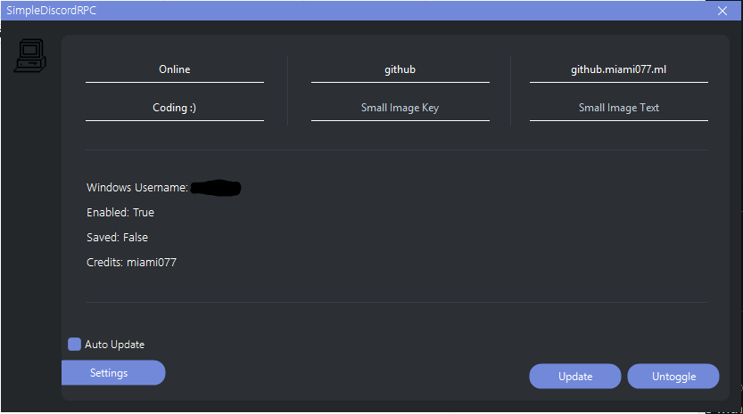

<h1 align="center">SimpleDiscordRPC</h1>

A Simple Discord Custom Rich Presence with Modern Design!

Read the <a href="https://miami077.ml/simplerpc/terms">Terms</a> before using Vizora or Vizora Source.
 

  
  
  

 

  
  
  
  
   
  <h3 align="center">Languages</h3>
  
EN-US

   
  

  

 
